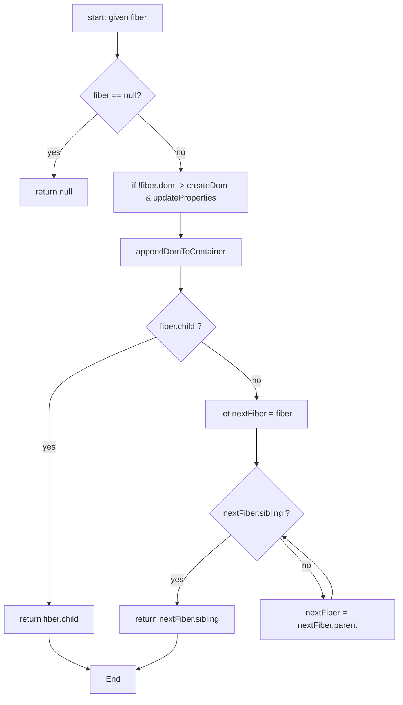
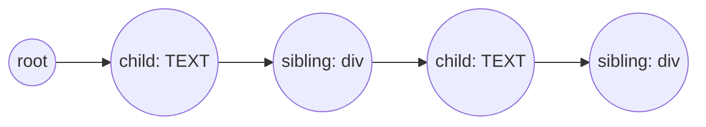

# mini-react-fiber-v1 深度学习笔记（面向初学者）

此文档对应仓库路径：`src/mini-react-fiber-v1`。
覆盖文件：
- `index.js`
- `createNestedFiberjs`

目标：把 `mini-react-fiber-v1` 中的实现拆解成非常详细的学习笔记，包含每个函数的逐行解释、流程图（Mermaid 文本）、算法伪码、可能的坑与改进建议，确保小白也能循序渐进理解 fiber + time-slicing 的核心思想。

---

## 目录

1. 目标与契约（Contract）
2. 高层运行流程（一步步走过整体）
3. fiber 数据结构详解
4. 逐函数详解
   - createDom
   - updateProperties
   - appendDomToContainer
   - performWorkOfUnit
   - workLoop + requestIdleCallback
5. createNestedFibers（测试树生成器）
6. 算法伪码与复杂度分析
7. Mermaid 流程图（可复制到支持 Mermaid 的渲染器查看）
8. 常见问题、陷阱与改进建议
9. 实验与调试步骤（如何运行、调参）
10. 练习题与扩展方向
11. 小结

---

## 1. 目标与契约

- 输入：一个以 fiber 结构表示的工作根（root fiber），在本示例里由 `createNestedFibers(depth)` 生成并赋值给 `nextWorkOfUnit`。
- 输出：对应的真实 DOM 节点被逐步创建并挂载到页面（优先挂到父 fiber 的 `dom`，若无则回退到 `#root`）。
- 成功条件：浏览器不会被长期阻塞，渲染能被分片执行（time-slicing），在多个空闲时间片内完成全部节点创建与挂载。
- 错误模式：找不到 `#root` 时不会报错但也不会挂载；属性处理简单导致事件/样式等行为缺失；回退挂载策略会破坏原始 DOM 结构。

实现契约（简明）
- 输入数据形状（Fiber 节点）：{ type, props, parent, child, sibling, dom }
- 主循环：浏览器空闲时调用 `workLoop(deadline)`，每次处理一个或多个 `performWorkOfUnit`，时间不够时保存 `nextWorkOfUnit` 并等待下一次空闲回调。

---

## 2. 高层运行流程

总体步骤：
1. 构造测试用 fiber 树（`createNestedFibers(depth)`）。
2. 启动调度器：`requestIdleCallback(workLoop)`。
3. 当浏览器空闲时运行 `workLoop(deadline)`，在时间允许内循环调用 `performWorkOfUnit`，创建 DOM 并挂载。
4. 当 `deadline.timeRemaining() < 1` 时让出 CPU，等待下一次空闲回调继续从 `nextWorkOfUnit` 处恢复。
5. 当 `performWorkOfUnit` 返回 `null`（没有更多任务）时，说明所有工作已完成。

这是一个简单、教学性的协作式调度（cooperative scheduling）示例，强调“把大任务拆成很多小任务并在空闲时段逐个执行”。

---

## 3. fiber 数据结构详解

在本实现中，每个 fiber 是一个普通的 JavaScript 对象，字段：
- `type`：节点类型，例如 `'div'` 或 `'TEXT_ELEMENT'`。
- `props`：属性对象，例如 `{ id: 'node-1', children: [] }`。
- `parent`：指向父 fiber（或 `null`）。
- `child`：指向第一个子 fiber（或 `null`）。
- `sibling`：指向下一个兄弟 fiber（或 `null`）。
- `dom`：对应的真实 DOM 节点（或 `null`，当还没创建时）。

性质与设计意图：
- 使用 child/sibling/parent 指针可以在不使用 JavaScript 调用栈（函数递归）的情况下遍历整棵树，这在处理深层嵌套时能避免栈溢出风险。
- `props.children` 在这里并不是 DOM 属性，而用于原始虚拟树或构建树的占位（`updateProperties` 会跳过 `children` 字段）。

示例（轻量化展示，depth=3）：
```
root (div)
 └ child -> TEXT(level1)
           └ sibling -> div#node-1
                      └ child -> TEXT(level2)
                                └ sibling -> div#node-2
                                           └ child -> TEXT(level3)
``` 

---

## 4. 逐函数详解

下面按文件中的函数逐一详细讲解每个实现细节与边界情况。

### 4.1 createDom(fiber)

作用：根据 fiber 创建真实 DOM 节点（但不设置属性/内容）。

核心实现要点：
- 如果 `fiber.type === 'TEXT_ELEMENT'`，调用 `document.createTextNode('')` 创建文本节点（先留空字符串）。
- 否则，调用 `document.createElement(fiber.type)` 创建元素节点。

细节与解释：
- 文本节点内容是在 `updateProperties` 中通过 `dom.nodeValue = props.nodeValue` 写入的，因此 `createTextNode('')` 是可行的。把创建与赋值分离是一种职责分离的做法。
- 优化点：可以直接用 `document.createTextNode(fiber.props.nodeValue || '')` 一步完成创建并赋值，减少一次写操作。

可能的问题：
- 如果 `fiber.type` 不是合法的 DOM 元素名称（例如自定义 React 组件），`createElement` 会抛出错误（本示例只考虑字符串类型的 DOM 元素）。

### 4.2 updateProperties(dom, props)

作用：把 props 应用到 DOM 节点（简单版）。

实现要点：
- 先过滤掉 `children`（`isProperty = key => key !== 'children'`）。
- 对其余每个 key 执行 `dom[key] = props[key]`。

示例：
- 对于 `{ id: 'node-1' }`，执行 `dom.id = 'node-1'`，等价于设置了元素的 id。
- 对于文本节点，会对 `nodeValue` 做 `dom.nodeValue = '...'`。

局限性与注意：
- 直接 `dom[key] = value` 对许多属性是可行的（id, className, nodeValue），但对事件属性（onClick）或 style 对象需特殊处理。
- 真实框架会在 update 时做差分（patch）而不是每次都直接覆盖属性。

扩展建议：
- 为 `style` 做特殊分支：如果 `props.style` 是对象，逐键设置 `dom.style[key] = value`。
- 对以 `on` 开头的事件名，使用 `addEventListener`/`removeEventListener` 管理。

### 4.3 appendDomToContainer(domNode, parentFiber)

作用：把当前节点挂载到合适的容器。

挂载策略（代码逻辑）：
1. 先查找根容器 `document.querySelector('#root')` 作为兜底。
2. 如果 `parentFiber` 存在且 `parentFiber.dom` 存在，则调用 `parentFiber.dom.appendChild(domNode)`。
3. 如果 `parentFiber` 存在但 `parentFiber.dom` 还没创建，则直接把节点挂到 `#root`（演示用简化策略）。
4. 如果没有 `parentFiber`，也挂到 `#root`。

为什么这样设计：
- 在 time-slicing 场景中，父节点可能还没被处理完但我们已经创建了子节点。为了尽量让用户看到逐步产生的内容（提高感知性能），演示代码把子节点回退挂载到根节点而不是等待父节点。

缺点与边界情况：
- 回退到根会破坏 DOM 的层级结构和样式依赖（例如依赖父元素 layout 的子元素会变形）。
- 更严谨的实现会缓存这些“待挂载”节点，在父 DOM 创建好后进行正确的插入。

扩展改进：
- 为父 fiber 添加 `pendingChildren` 队列，在父 DOM 可用时批量插入，以保证结构正确且减少 reflow（或使用 DocumentFragment）。

### 4.4 performWorkOfUnit(fiber)

这是核心：对单个 fiber 执行工作并返回下一个要执行的 fiber。

步骤（与伪码高度一致）：
1. 若 `fiber` 为 null，返回 null（没有工作）。
2. 若 `fiber.dom` 不存在：
   - `fiber.dom = createDom(fiber)`
   - `updateProperties(fiber.dom, fiber.props)`
3. `appendDomToContainer(fiber.dom, fiber.parent)`
4. 寻找下一个要处理的 fiber：
   - 如果 `fiber.child` 存在，返回 `fiber.child`（进入下一层）
   - 否则，从当前 fiber 向上（`nextFiber = fiber`）循环：
     - 若 `nextFiber.sibling` 存在，返回 `nextFiber.sibling`
     - 否则 `nextFiber = nextFiber.parent`（继续回溯）
   - 如果到达根还没有发现兄弟，返回 null（任务完成）

算法说明（行为）
- 这是一个非递归的前序深度优先遍历： 当前节点 -> 子节点 -> 兄弟节点 -> 回溯 -> 继续。
- 返回值是下一个要处理的 fiber，这使得 `workLoop` 可以在每个时间片内多次处理节点并在时间耗尽时保存 `nextWorkOfUnit`。

复杂度：
- 每个 fiber 在首次被处理时会创建 DOM，后续若不再创建则不会重复 DOM 构建 -> 总体 O(n)。
- 空间 O(1)（除 fiber 树本身）。

边界与注意：
- 如果 `appendDomToContainer` 把子节点回退挂载到 root，最终可能需要一次“commit 调整”来把子节点插回正确位置——演示代码没有这一步。

### 4.5 workLoop(deadline) 与 requestIdleCallback

目的：使用浏览器的空闲回调实现时间切片（time-slicing），每次空闲都只做少量工作以避免长时间阻塞主线程。 

实现要点：
- `workLoop` 会循环执行 `performWorkOfUnit(nextWorkOfUnit)` 并在每次循环后检查 `deadline.timeRemaining()`。
- 当 `deadline.timeRemaining() < 1` 时，设置 `shouldYield = true` 并中止循环，随后再次调用 `requestIdleCallback(workLoop)` 以在下一次空闲时继续工作。

解释 `deadline.timeRemaining()`：
- 由浏览器传入，表示当前空闲回调还能使用的大概毫秒数。
- 这个 API 的精确行为取决于浏览器实现；它提供了一个让出窗口来避免与渲染/交互冲突的简单手段。

兼容性与替代实现：
- `requestIdleCallback` 并非在所有浏览器中都可用（部分 Safari/移动浏览器历史上未支持或支持不完全）。
- 可使用 polyfill（基于 `requestAnimationFrame` + `setTimeout`）或直接使用 `requestAnimationFrame` 实现每帧工作（但无法获得精确的“剩余空闲时间”）。

阈值选择：
- 本示例使用 `< 1ms` 作为让出阈值，保守但可能导致更多轮次切换。可根据实际体验将阈值增大（例如 `< 5ms`）来减少切换次数但可能增加单次阻塞。

---

## 5. createNestedFibers(depth)

作用：构造一个深度为 `depth` 的测试用 fiber 树，交替生成 `TEXT_ELEMENT` 和 `div`，并设置 parent/child/sibling 指针，返回根节点。

实现策略（优点）：
- 使用循环而非递归来构建指针关系，更高效且对于大 depth 不会触发 JS 栈溢出。
- 每次创建 `textFiber` 与 `divFiber`，把 `parent.child = textFiber`，`textFiber.sibling = divFiber`，然后把 `parent = divFiber` 进入下一层。

示例（depth = 3 的视觉结构）：
```
root(div#test-root)
 └ child -> TEXT(level1)
           └ sibling -> div#node-1
                      └ child -> TEXT(level2)
                                └ sibling -> div#node-2
                                           └ child -> TEXT(level3)
                                                     └ sibling -> div#node-3
```

用途：用于在浏览器中触发大量 DOM 创建，观察 time-slicing 的效果与性能影响。

---

## 6. 算法伪码与复杂度

workLoop 的伪码：

```
function workLoop(deadline):
    shouldYield = false
    while not shouldYield:
        nextWorkOfUnit = performWorkOfUnit(nextWorkOfUnit)
        shouldYield = deadline.timeRemaining() < 1
    requestIdleCallback(workLoop)
```

performWorkOfUnit 的伪码：

```
function performWorkOfUnit(fiber):
    if fiber == null:
        return null

    if fiber.dom == null:
        fiber.dom = createDom(fiber)
        updateProperties(fiber.dom, fiber.props)

    appendDomToContainer(fiber.dom, fiber.parent)

    if fiber.child:
        return fiber.child

    nextFiber = fiber
    while nextFiber != null:
        if nextFiber.sibling:
            return nextFiber.sibling
        nextFiber = nextFiber.parent

    return null
```

复杂度：
- 时间复杂度（单次完整渲染）：O(n)，每个 fiber 创建 dom 时被访问一次。
- 空间复杂度：O(n)（fiber 树）；运行时额外空间近似 O(1)。

---

## 7. Mermaid 流程图（文本形式）

下面是几个可复制到支持 Mermaid 的渲染器（如 VSCode Mermaid 插件、GitHub README 的 Mermaid 渲染器、一些在线 mermaid live editors）查看的流程图文本。

工作循环与调度：

```mermaid
flowchart TD
  A[Start: script load] --> B[createNestedFibers -> nextWorkOfUnit]
  B --> C[requestIdleCallback(workLoop)]
  C --> D{browser idle?}
  D -->|yes| E[workLoop(deadline)]
  E --> F[performWorkOfUnit(nextWorkOfUnit)]
  F --> G{timeRemaining < 1?}
  G -->|no| E
  G -->|yes| H[yield -> wait next idle callback]
  H --> C
  F --> I{nextWorkOfUnit == null?}
  I -->|yes| J[All work done]
  I -->|no| E
```

performWorkOfUnit 的遍历流程：



Fiber 节点关系示意：



---

## 8. 常见问题、陷阱与改进建议

常见问题（FAQ）：

- 为什么使用 `createTextNode('')` 而不是直接给文本？
  - 答：实现把“创建”和“赋值”分开；`updateProperties` 会写入 `nodeValue`。可优化为一步创建并赋值。

- 把子节点回退挂载到 `#root` 会有什么风险？
  - 答：会破坏 DOM 结构和样式依赖，真实实现不会这样做。更好的方法是缓存并在父 DOM 准备好时插回。

- `updateProperties` 直接 `dom[key] = value` 有什么限制？
  - 答：对简单属性可用，但对事件、style、dataset 等要特殊处理。生产代码需要区分属性类型并做差分更新。

改进建议（可作为下一步工作）：
1. 实现挂载占位机制：当父 DOM 未准备时缓存子节点，父准备好后批量插入。
2. 对 `updateProperties` 做更完整的 patch（支持 style 对象、事件处理、移除旧属性等）。
3. 为 `requestIdleCallback` 添加兼容 polyfill（使用 `requestAnimationFrame` + `setTimeout`）。
4. 实现 reconciliation（diff）来支持更新而不是每次重建 DOM。
5. 将“构建阶段”（创建 fiber tree）与“提交阶段”（一次性插入 DOM）分离，减少中间不一致状态。

---

## 9. 实验与调试步骤（如何在本仓库运行）

下面给出在本仓库中运行和调试该示例的建议步骤：

1. 安装依赖（如果项目使用 pnpm）：

```bash
pnpm install
```

2. 启动开发服务器（如果项目使用 Vite）：

```bash
pnpm dev
```

3. 打开浏览器访问开发服务器地址（通常是 `http://localhost:5173`），并打开 DevTools 的 Console/Performance 面板观察渲染和主线程活动。

4. 在 `src/mini-react-fiber-v1/index.js` 文件底部调整深度：

```js
nextWorkOfUnit = createNestedFibers(100); // 改为 10 / 500 试验不同规模
```

5. 在 `workLoop` 中调整让出阈值（`deadline.timeRemaining() < 1`）为 `< 5` 或 `< 8`，观察流畅度与总耗时之间的变化。

6. 增加日志以追踪进度：

```js
console.log('processing: ', fiber && fiber.type, 'remaining:', deadline.timeRemaining());
```

7. 如果需要对没有 `requestIdleCallback` 的浏览器做兼容测试，可临时替换：

```js
// 简单 polyfill（示意）：
window.requestIdleCallback = window.requestIdleCallback || function(cb) {
  return setTimeout(function(){
    cb({ timeRemaining: function(){ return 50 } })
  }, 1)
}
```

（注意：这是示意 polyfill，不精准。生产 polyfill 需要更复杂的调度逻辑。）

---

## 10. 练习题（巩固理解）

1. 把 `createDom` 改为直接在创建时写入文本内容（对 `TEXT_ELEMENT` 使用 `document.createTextNode(fiber.props.nodeValue || '')`），验证行为一致。
2. 修改 `appendDomToContainer`：在父 DOM 未就绪时把子元素缓存到 `parentFiber.pendingChildren`，当父 DOM 创建时把 pendingChildren 全部插入。比较页面结构并写出优缺点。
3. 为 `updateProperties` 实现对 `style` 对象的处理（例如：`props.style = { color: 'red' }` 应映射到 `dom.style.color = 'red'`）。
4. 实现一个简单的 polyfill，用 `requestAnimationFrame` + `setTimeout` 模拟 `requestIdleCallback`。
5. 思考：如何把当前模型改为“构建阶段与提交阶段分离”的实现？写出你会增加的字段和流程（例如 commitQueue、placement 标记等）。

---

## 11. 小结

- 本示例是一个教学版的 Fiber+time-slicing 实现，用来展示如何把大规模 DOM 创建任务拆分成小块并在浏览器空闲时逐步执行，避免长时间阻塞主线程。
- 核心要点：
  - 使用指针式 fiber 树（parent/child/sibling）做非递归遍历；
  - `performWorkOfUnit` 返回“下一个要处理的 fiber”，便于中断与恢复；
  - 使用 `requestIdleCallback` + `deadline.timeRemaining()` 做时间切片调度；
  - 为了演示性简单，采用了把无法插入到父 DOM 的子节点回退到 `#root` 的策略，但这不是生产做法。

如果你希望，我可以进一步：
- 把该 Markdown 文件放入仓库（已完成）并在 PR 中提交；
- 实现几个改进（例如 pendingChildren 缓存、style 处理、requestIdleCallback polyfill）；
- 为核心函数添加单元测试（使用 Jest + jsdom）并在本地运行验证。

---

文件生成位置：`src/mini-react-fiber-v1/mini-react-fiber-v1-explained.md`。

欢迎告诉我接下来要做的动作（例如：提交变更到分支、实现某个改进、添加测试）。
